# Panduan Regenerasi Image Subang 360

Dokumen ini mencatat **19 file image Subang yang aktif digunakan website** pada 21 Juli 2026. Setiap file ditampilkan bersama label, posisi pemakaian, referensi foto nyata yang ditemukan melalui Google Images, dan prompt siap pakai untuk image-gen.

## Cara menggunakan referensi

1. Unggah **Image 1** dari tautan referensi sebagai acuan fakta visual: bentuk lokasi, vegetasi, warna, material, makanan, pakaian, dan suasana nyata.
2. Unggah **Image 2** dari aset website saat ini sebagai acuan komposisi dan rasio saja.
3. Jalankan prompt pada bagian file terkait. Jangan meminta model menyalin orang, logo, tulisan, watermark, atau detail berhak cipta dari foto referensi.
4. Kecuali referensi Wikimedia Commons yang lisensinya disebutkan, foto sumber di bawah adalah **referensi visual saja**. Jangan menerbitkan ulang foto aslinya tanpa izin pemilik.
5. Setelah regenerasi, periksa lagi anatomi manusia, jumlah jari, bentuk alat makan, tulisan, geografi, spesies tanaman, dan detail budaya.

Aturan realisme yang berlaku untuk semua prompt: dokumenter perjalanan/editorial, cahaya alami, dynamic range masuk akal, tekstur tidak sempurna, sedikit grain kamera, warna Indonesia yang natural, tanpa HDR berlebihan, tanpa glow fantasi, tanpa kulit plastik, tanpa simetri artifisial, tanpa teks, tanpa logo, dan tanpa watermark.

---

## 1. `public/images/subang/ciater-waterfall.png`

**Label/judul:** Air terjun di hutan tropis Subang — Curug Cibareubeuy  
**Dipakai pada:** visual pembuka landing page  
**Ukuran saat ini:** 1122 × 1402 px, portrait

### Image saat ini

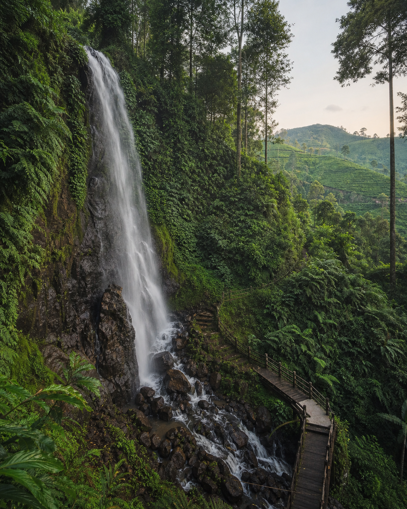

### Referensi Google Images

Query: `Curug Cibareubeuy Subang foto asli`

[](https://jadesta.kemenpar.go.id/atraksi/curug_cibareubeuy)

Sumber: Jadesta Kementerian Pariwisata. Dipilih karena memperlihatkan aliran air tinggi, tebing gelap, kolam, dan vegetasi lembap di lokasi sebenarnya. Hak publikasi perlu dikonfirmasi; gunakan sebagai acuan visual.

### Prompt image-gen

```text
Create a photorealistic vertical documentary travel photograph of Curug Cibareubeuy in Subang, West Java.

Input images: Image 1 is the factual real-photo reference for the waterfall, rock formation, vegetation, and natural color. Image 2 is the current website asset; use it only for the portrait composition and visual hierarchy, not for invented details.

Scene: a tall narrow waterfall descending over naturally weathered dark volcanic rock into a small pool, surrounded by dense humid West Java forest. Keep the vegetation irregular and layered, with wet leaves, moss, exposed roots, mist, and realistic water flow. Camera at human eye level from the trail, 35mm documentary lens, soft overcast daylight, restrained greens, believable shadows, mild sensor grain. No people. Preserve generous negative space for landing-page copy. 4:5 portrait crop.

Avoid fantasy cliffs, turquoise resort water, perfectly arranged plants, excessive fog, HDR halos, painterly detail, text, logos, and watermarks.
```

---

## 2. `public/images/subang/expanded/curug-cibareubeuy.webp`

**Label/judul:** Curug Cibareubeuy  
**Dipakai pada:** detail destinasi tambahan di explorer  
**Ukuran saat ini:** 1200 × 900 px, 4:3

### Image saat ini

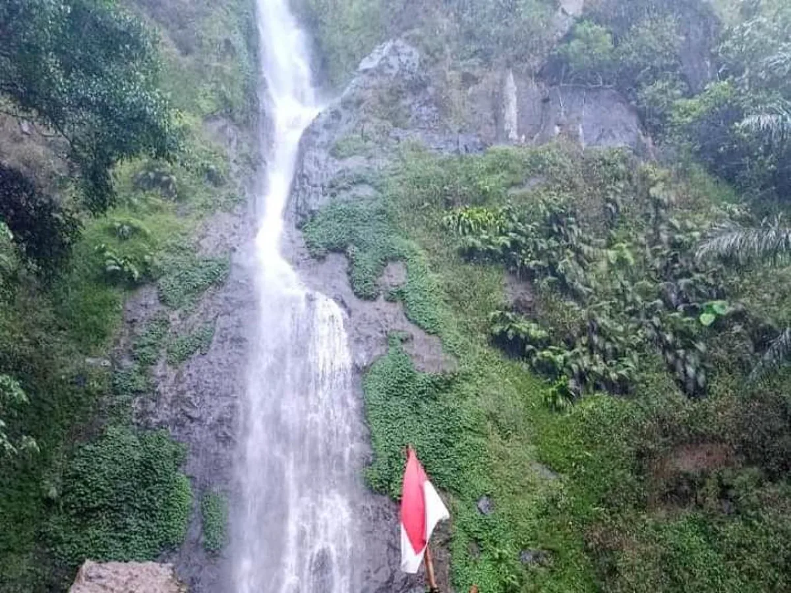

### Referensi Google Images

Query: `Curug Cibareubeuy Subang foto asli`

[](https://jadesta.kemenpar.go.id/atraksi/curug_cibareubeuy)

Sumber: Jadesta Kementerian Pariwisata. Referensi yang sama dipakai agar representasi lokasi konsisten, tetapi framing dibuat landscape untuk kartu detail. Hak publikasi perlu dikonfirmasi.

### Prompt image-gen

```text
Generate a natural 4:3 editorial travel photo of Curug Cibareubeuy, Subang.

Input images: Image 1 is the factual location reference. Image 2 is the current card image and is only a composition/aspect-ratio guide.

Show the real waterfall and dark rock face in a wider landscape view, with a believable footpath edge and dense uneven tropical vegetation framing the falls. Wet stone surfaces, subdued overcast daylight, realistic white water with slight motion blur, natural West Java humidity, no staged subject. Shot on a full-frame camera with a 35mm lens, neutral color science, modest contrast, small real-world imperfections. Leave the central waterfall clearly readable at card size.

Do not add fantasy architecture, impossible cliffs, neon green foliage, turquoise water, fake sun rays, people, text, logos, or watermarks.
```

---

## 3. `public/images/subang/expanded/museum-subang.webp`

**Label/judul:** Museum Kabupaten Subang / Wisma Karya  
**Dipakai pada:** detail destinasi tambahan di explorer  
**Ukuran saat ini:** 1200 × 800 px, 3:2

### Image saat ini

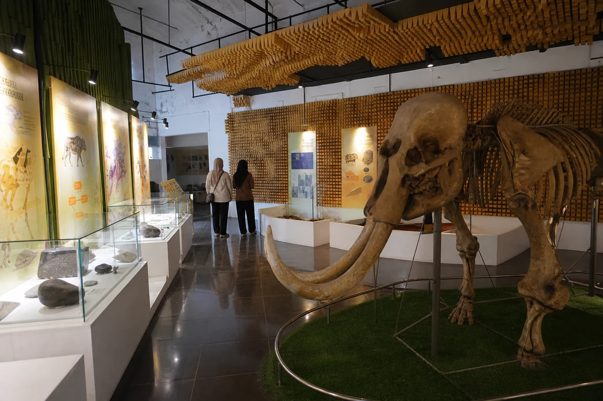

### Referensi Google Images

Query: `Museum Subang Wisma Karya interior foto`

[](https://museumsubang.com/berita_deskripsi/38/)

Sumber: situs resmi Museum Kabupaten Subang. Dipilih untuk menambatkan bentuk ruang, vitrin, koleksi, pencahayaan, dan skala interior ke museum sebenarnya. Hak publikasi perlu dikonfirmasi.

### Prompt image-gen

```text
Create a photorealistic 3:2 editorial interior photograph of Museum Kabupaten Subang inside Wisma Karya.

Input images: Image 1 is the factual museum reference for architecture, display cases, collection types, floor, and lighting. Image 2 is the current website image; preserve only its wide card-friendly composition.

Depict a modest Indonesian regional museum interior with authentic glass vitrines, historical objects and fossils, practical ceiling lights, slightly worn but well-maintained surfaces, and realistic spacing. Eye-level 28mm lens, straight architectural lines, available indoor light mixed with daylight, neutral white balance, gentle grain. Include at most two distant visitors viewed from behind for scale. Keep exhibit labels too small to read rather than inventing text.

Avoid futuristic galleries, luxury finishes, dramatic spotlights, fabricated readable labels, duplicated artifacts, warped vitrines, text, logos, and watermarks.
```

---

## 4. `public/images/subang/hero-panorama.png`

**Label/judul:** Panorama utama Subang — Kebun Teh Ciater  
**Dipakai pada:** panorama explorer dan background CTA akhir  
**Ukuran saat ini:** 1672 × 941 px, 16:9

### Image saat ini

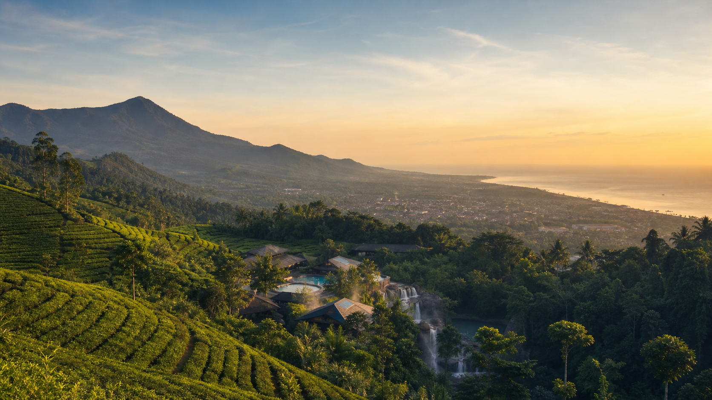

### Referensi Google Images

Query: `Kebun Teh Ciater Subang foto asli`

[](https://commons.wikimedia.org/wiki/File:Perkebunan_Teh.jpg)

Sumber: Wikimedia Commons, lokasi Ciater, Subang; lisensi CC BY-SA 4.0 pada halaman sumber. Dipilih agar panorama mengikuti topografi perkebunan teh nyata dan tidak menjadi komposit gunung-laut yang mustahil.

### Prompt image-gen

```text
Generate a highly realistic wide panorama of the Ciater tea plantations in Subang, West Java, for an interactive tourism hero.

Input images: Image 1 is the factual reference for tea rows, terrain, vegetation, climate, and distant mountain scale. Image 2 is the current panorama; use only its 16:9 composition, horizon placement, and room for interface overlays.

Scene: rolling tea fields with irregular working paths, mature shade trees, humid morning air, and a naturally hazy volcanic ridge in the distance. Use soft early-morning daylight with real cloud cover, restrained saturation, believable aerial perspective, fine leaf texture near camera and softer detail far away. Camera at standing height, 24mm lens without extreme distortion. Keep the middle and lower regions readable behind UI controls.

Geography must feel plausible for Ciater. Do not combine ocean, waterfalls, rice terraces, or multiple landmarks in one view. No fantasy peaks, perfect mirrored tea rows, exaggerated mist, HDR glow, people close to camera, text, logos, or watermarks.
```

---

## 5. `public/images/subang/landing/ciater-hot-spring.webp`

**Label/judul:** Pemandian Air Panas Alam Sari Ater, Ciater  
**Dipakai pada:** kartu destinasi Ciater dan itinerary akhir pekan  
**Ukuran saat ini:** 1200 × 900 px, 4:3

### Image saat ini

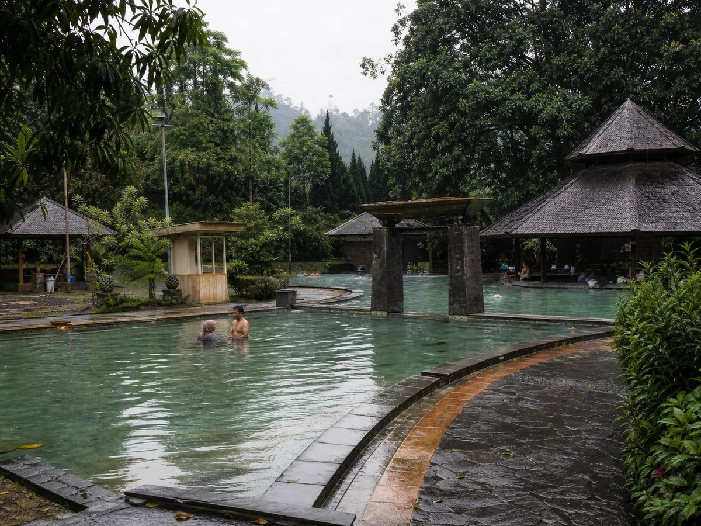

### Referensi Google Images

Query: `Sari Ater Ciater pemandian air panas foto asli`

[/data/photo/2024/10/01/66fb1f7b01a2f.jpg>)](https://travel.kompas.com/read/2024/10/01/073100327/daya-tarik-pemandian-air-panas-alam-sari-ater-di-ciater-subang)

Sumber: Kompas Travel. Dipilih karena menunjukkan bentuk kolam batu, vegetasi, dan karakter fasilitas Sari Ater yang nyata. Hak publikasi perlu dikonfirmasi; watermark sumber tidak boleh direplikasi.

### Prompt image-gen

```text
Create a candid, photorealistic 4:3 travel photograph of the natural hot-spring pools at Sari Ater, Ciater, Subang.

Input images: Image 1 is the factual location reference for pool geometry, stone materials, water color, landscaping, and facilities. Image 2 is only the current website composition guide.

Show a real public hot-spring environment: warm clear water with subtle steam, dark natural stone edges, mature tropical planting, practical paths and railings, and a few Indonesian visitors in ordinary modest swimwear seen naturally at a distance. Soft cloudy mountain daylight, realistic skin and water reflections, 35mm lens, documentary framing, mild grain, no staged luxury-resort styling.

Avoid empty fantasy pools, glowing turquoise water, excessive steam, tropical-resort clichés, perfect symmetry, distorted bodies, readable signage, copied watermark, text, or logos.
```

---

## 6. `public/images/subang/landing/family-coast-itinerary.webp`

**Label/judul:** Itinerary keluarga di pesisir Pantai Cirewang  
**Dipakai pada:** kartu itinerary keluarga  
**Ukuran saat ini:** 1500 × 1000 px, 3:2

### Image saat ini

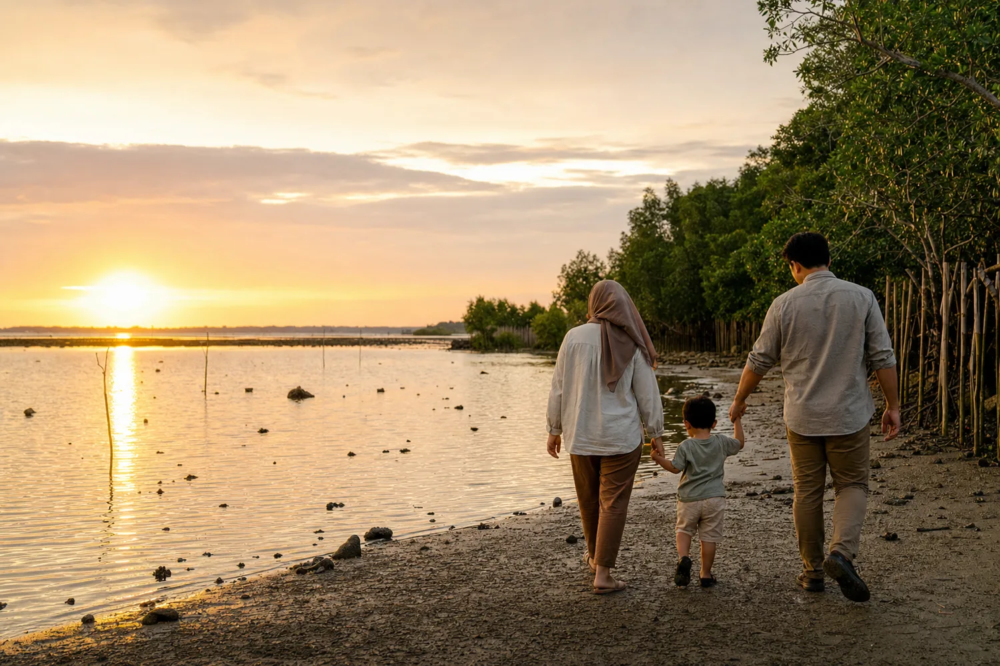

### Referensi Google Images

Query: `Pantai Cirewang Subang foto asli`

[](https://www.inilah.com/pantai-cirewang-subang)

Sumber: Inilah.com. Dipilih karena memperlihatkan pesisir Cirewang yang sebenarnya: pasir kecokelatan, laut tenang, pepohonan pesisir, dan bukan pantai tropis berpasir putih. Hak publikasi perlu dikonfirmasi.

### Prompt image-gen

```text
Generate a realistic 3:2 candid family travel photograph at Pantai Cirewang, Subang.

Input images: Image 1 is the factual reference for the coastline, sand, mangroves, water color, and local atmosphere. Image 2 is only a guide for family-oriented composition.

Show an Indonesian family of four walking naturally along the brown sandy shore, photographed from behind or three-quarter distance so faces are not the focal point. Include the calm Java Sea, irregular coastal trees, mangrove character, scattered natural driftwood, and simple local beach conditions. Late-afternoon natural light under a slightly hazy sky, 35mm lens, unstaged moment, ordinary practical clothing, natural body proportions and footsteps.

Do not turn Cirewang into a white-sand turquoise resort. Avoid matching outfits, posed advertising smiles, luxury facilities, perfect footprints, malformed hands, excessive sunset colors, text, logos, or watermarks.
```

---

## 7. `public/images/subang/landing/nasi-liwet.webp`

**Label/judul:** Nasi Liwet Sunda  
**Dipakai pada:** kartu kuliner landing page  
**Ukuran saat ini:** 1200 × 900 px, 4:3

### Image saat ini

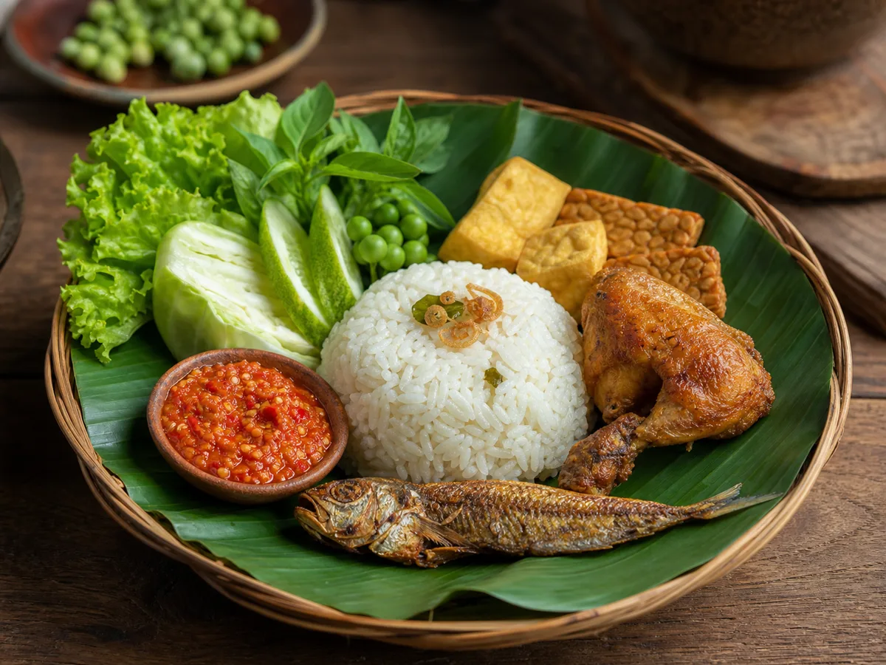

### Referensi Google Images

Query: `Nasi Liwet Sunda asli foto`

[:strip_icc():format(jpeg)/kly-media-production/medias/4902749/original/008585700_1722065817-shutterstock_2491751147.jpg)](https://www.fimela.com/food/read/5697175/resep-nasi-liwet-sunda-asli-hanya-dengan-bahan-sederhana)

Sumber: Fimela Food. Dipilih karena susunan lauk dan tekstur nasi lebih dekat dengan penyajian liwet Sunda yang nyata. Hak publikasi perlu dikonfirmasi.

### Prompt image-gen

```text
Create a photorealistic 4:3 editorial food photograph of authentic Sundanese nasi liwet served in a modest West Java setting.

Input images: Image 1 is the factual reference for rice texture, anchovies, chilies, herbs, banana leaf, and serving style. Image 2 is the current website image and should guide only the crop.

Show fragrant off-white liwet rice with visible individual grains, small anchovies, sliced red chili, bay leaf and lemongrass, accompanied by simple Sundanese side dishes and sambal on a slightly creased banana leaf. Natural window light from one side, ordinary wooden table with minor wear, 50mm lens, shallow but believable depth of field, imperfect hand-served portions, realistic oil and steam.

Avoid luxury plating, perfect radial arrangement, floating garnish, plastic-looking rice, excessive steam, orange HDR color, cutlery errors, text, logos, or watermarks.
```

---

## 8. `public/images/subang/landing/sate-maranggi.webp`

**Label/judul:** Sate Maranggi Subang  
**Dipakai pada:** kartu kuliner landing page  
**Ukuran saat ini:** 1200 × 900 px, 4:3

### Image saat ini

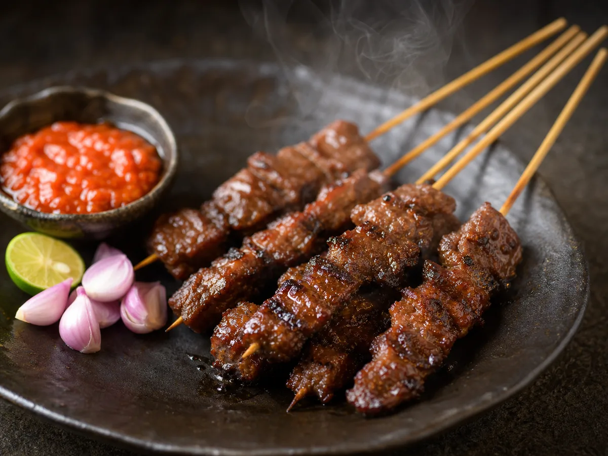

### Referensi Google Images

Query: `Sate Maranggi Subang foto asli`

[](https://www.detik.com/jabar/kuliner/d-6198636/sate-maranggi-legendaris-di-subang)

Sumber: detikJabar, liputan Sate Maranggi Tata di Subang. Dipilih karena konteksnya lokal Subang dan bentuk sate, arang, serta penyajiannya nyata. Hak publikasi perlu dikonfirmasi; watermark tidak boleh direplikasi.

### Prompt image-gen

```text
Generate a natural 4:3 editorial food photo of sate maranggi as served at a local Subang warung.

Input images: Image 1 is the factual reference for skewer size, meat texture, charring, grill context, and local serving style. Image 2 is only a crop and composition guide.

Show irregular hand-cut beef pieces on bamboo skewers with believable caramelization and char, just lifted from a charcoal grill and served with a simple tomato-chili condiment. Use soft available daylight mixed with warm grill light, a slightly worn warung table, subtle smoke, realistic grease and meat fibers, 50mm lens, candid editorial framing. Make every skewer slightly different.

Avoid identical meat cubes, glossy plastic sauce, towering food styling, flames engulfing the food, perfect symmetry, floating garnish, malformed skewers, copied watermark, text, or logos.
```

---

## 9. `public/images/subang/landing/sop-kikil-subang.webp`

**Label/judul:** Sop Kikil Sapi  
**Dipakai pada:** kartu kuliner landing page  
**Ukuran saat ini:** 1200 × 900 px, 4:3

### Image saat ini

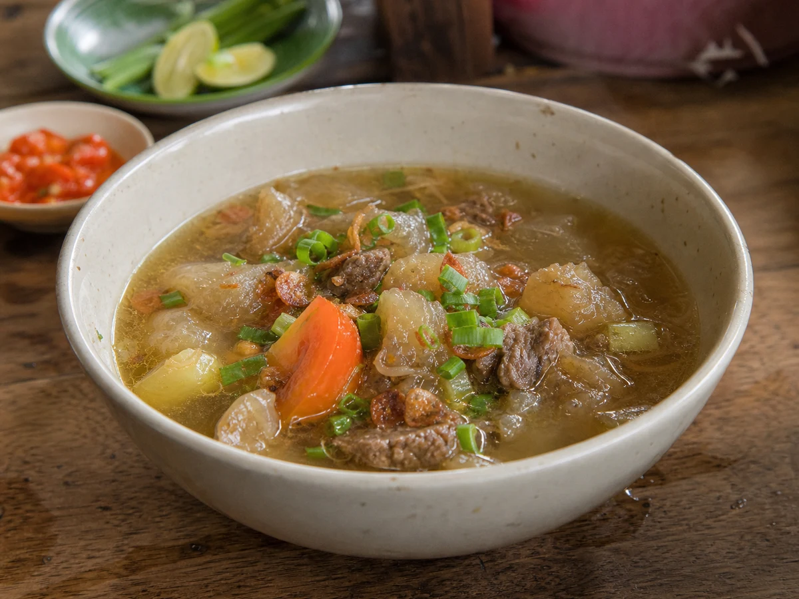

### Referensi Google Images

Query: `Sop Kikil Sapi Indonesia foto asli`

[](https://www.reseppedia.com/resep-masakan-sop-kikil-khas-jakarta-betawi)

Sumber: ResepPedia. Dipilih untuk mengikat warna kuah, tekstur kikil, taburan, dan mangkuk ke tampilan hidangan nyata. Referensi bersifat umum Indonesia; validasi resep khas warung Subang tetap disarankan. Hak publikasi perlu dikonfirmasi.

### Prompt image-gen

```text
Create a photorealistic 4:3 editorial food photograph of Indonesian beef-tendon soup served at a humble Subang eatery.

Input images: Image 1 is the factual reference for broth clarity, kikil texture, garnish, and bowl scale. Image 2 is the current website image and only defines the crop.

Show a well-used ceramic bowl with warm golden savory broth, irregular translucent-tender kikil pieces, small tomato and scallion accents, fried shallots, and a simple sambal dish nearby. Side-window daylight, realistic steam that does not obscure the food, 50mm lens, restrained color, ordinary laminate or wooden warung table, minor spills and natural imperfection.

Avoid thick fantasy gravy, oversized meat, perfect garnish patterns, floating ingredients, plastic shine, excessive steam, luxury tableware, text, logos, or watermarks.
```

---

## 10. `public/images/subang/landing/subang-360-preview.webp`

**Label/judul:** Preview antarmuka explorer Subang 360  
**Dipakai pada:** section pengenalan pengalaman 360  
**Ukuran saat ini:** 1600 × 900 px, 16:9

### Image saat ini

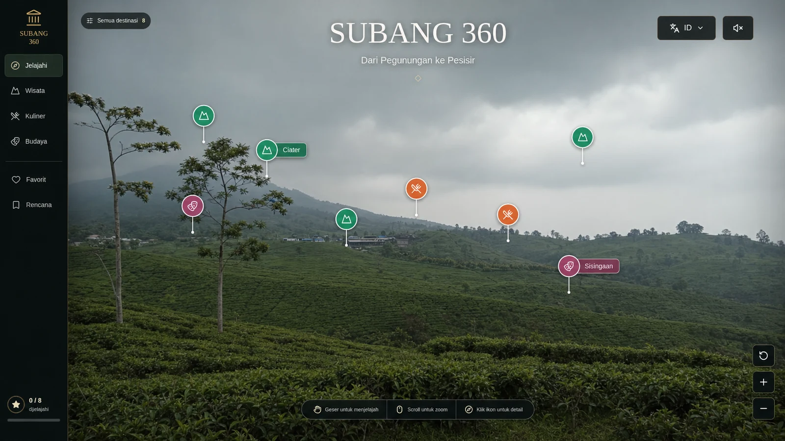

### Referensi Google Images

Query: `Kebun Teh Ciater Subang foto asli`

[](https://commons.wikimedia.org/wiki/File:Perkebunan_Teh.jpg)

Sumber: Wikimedia Commons, Ciater, Subang; CC BY-SA 4.0. Di sini foto hanya menjadi bahan pengganti panorama di dalam mockup. File ini sebaiknya dibuat dengan mode edit presisi agar UI tidak rusak.

### Prompt image-gen

```text
Perform a precise image edit on the current Subang 360 interface preview.

Input images: Image 1 is the current UI screenshot and is the exact edit target. Image 2 is the factual Ciater tea-plantation reference.

Change only the large landscape/panorama area inside the interface. Replace its synthetic scenery with a photorealistic Ciater tea plantation based on Image 2: real rolling tea rows, irregular paths, mature shade trees, humid natural haze, restrained green color, and plausible mountain scale. Match the existing perspective, crop, brightness, and 16:9 viewport.

Preserve every UI element exactly: layout, typography, Indonesian copy, icons, buttons, cards, spacing, border radius, and colors. Do not redraw, reinterpret, add, or remove interface elements. Do not invent text. The final output must still look like a real product screenshot, with no watermark or logo added to the panorama.
```

---

## 11. `public/images/subang/landing/tahu-susu.webp`

**Label/judul:** Tahu Susu Goreng  
**Dipakai pada:** kartu kuliner landing page  
**Ukuran saat ini:** 1200 × 900 px, 4:3

### Image saat ini

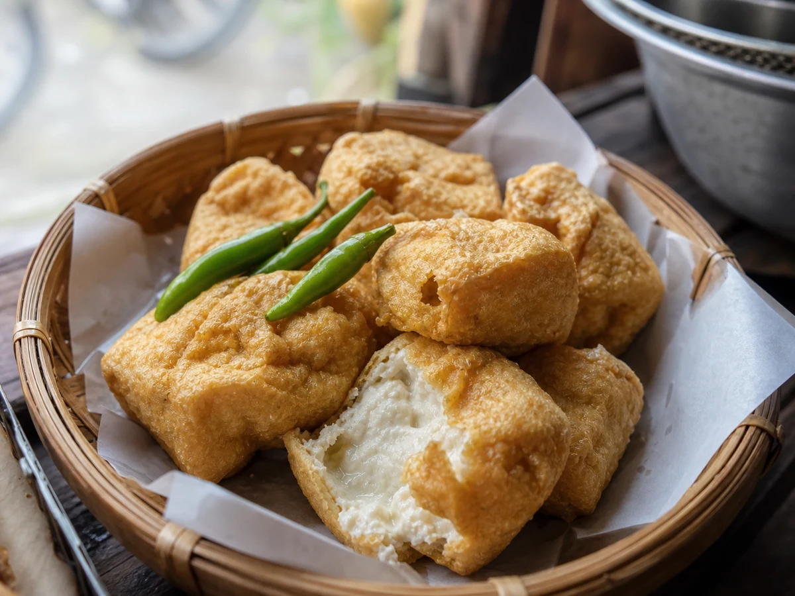

### Referensi Google Images

Query: `Tahu Susu goreng foto asli`

[](https://women.okezone.com/read/2025/02/27/298/3117959/resep-tahu-susu-goreng-praktis-cocok-jadi-takjil-berbuka-puasa)

Sumber: Okezone. Dipilih karena memperlihatkan kulit tahu yang tidak seragam dan bagian dalam yang lembut. Hak publikasi perlu dikonfirmasi.

### Prompt image-gen

```text
Generate a photorealistic 4:3 editorial food photograph of freshly fried tahu susu at a West Java snack stall.

Input images: Image 1 is the factual reference for tofu size, porous interior, thin fried skin, and natural color. Image 2 is only the current website composition guide.

Show several irregular golden tofu pieces in a simple paper-lined bamboo basket, one naturally broken open to reveal a soft pale center. Include a few whole green bird's-eye chilies placed casually. Soft daylight from the stall entrance, 50mm lens, shallow natural depth of field, slight oil marks on paper, believable crumbs and uneven browning.

Avoid identical cubes, cheese-like filling, perfectly clean surfaces, extreme crispness, floating crumbs, studio luxury styling, excessive orange color, text, logos, or watermarks.
```

---

## 12. `public/images/subang/sisingaan.png`

**Label/judul:** Pertunjukan budaya Sisingaan khas Subang  
**Dipakai pada:** hero section budaya landing page  
**Ukuran saat ini:** 1448 × 1086 px, 4:3

### Image saat ini

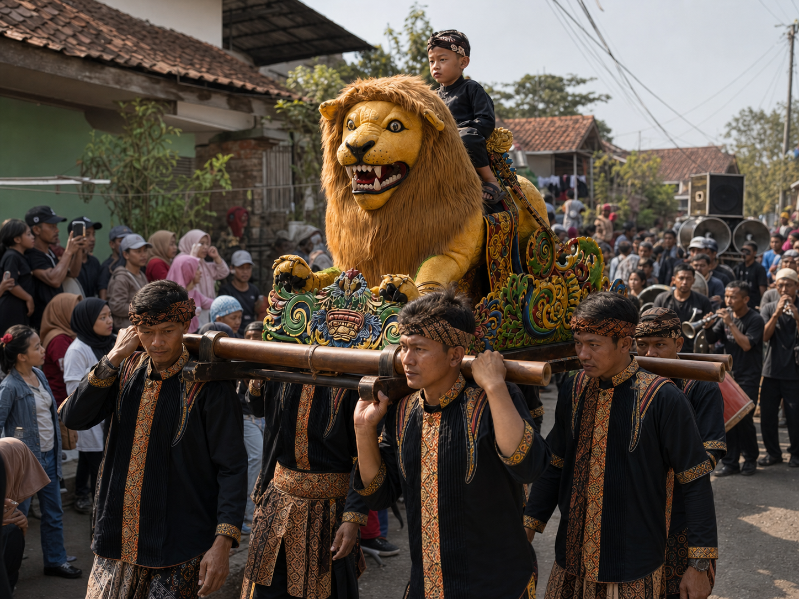

### Referensi Google Images

Query: `Sisingaan Subang pertunjukan foto asli`

[](https://commons.wikimedia.org/wiki/File:Atraksi_Kesenian_Sisingaan.jpg)

Sumber: Wikimedia Commons, atraksi Sisingaan di Subang; lisensi CC BY-SA 4.0 pada halaman sumber. Dipilih untuk menjaga bentuk tandu singa, jumlah pengusung, busana, skala, dan konteks kerumunan.

### Prompt image-gen

```text
Create a photorealistic 4:3 documentary photograph of an authentic Sisingaan performance in Subang, West Java.

Input images: Image 1 is the factual cultural reference for the lion effigy, carrying poles, four bearers, clothing, crowd, and performance scale. Image 2 is the current website asset; keep only its strong foreground composition.

Capture one crafted lion effigy carried correctly by four adult performers during a lively neighborhood procession. Show authentic local costume details, practical bamboo carrying structure, musicians and residents in an imperfect background, and natural expressions. Freeze the main motion at about 1/250 second while allowing slight movement in fabric and crowd. Daylight, 35mm photojournalistic lens, realistic skin, hands, weight, sweat, dust, and mixed colors.

This is a real community tradition, not fantasy. Do not turn the effigy into a living lion, add extra limbs or bearers, invent ceremonial symbols, make costumes royal or theatrical, beautify every face, add dramatic smoke, text, logos, or watermarks.
```

---

## 13. `public/images/subang/subang-culinary.png`

**Label/judul:** Kuliner Sunda di RM Mang Yeye, Subang  
**Dipakai pada:** detail destinasi tambahan RM Mang Yeye  
**Ukuran saat ini:** 1448 × 1086 px, 4:3

### Image saat ini

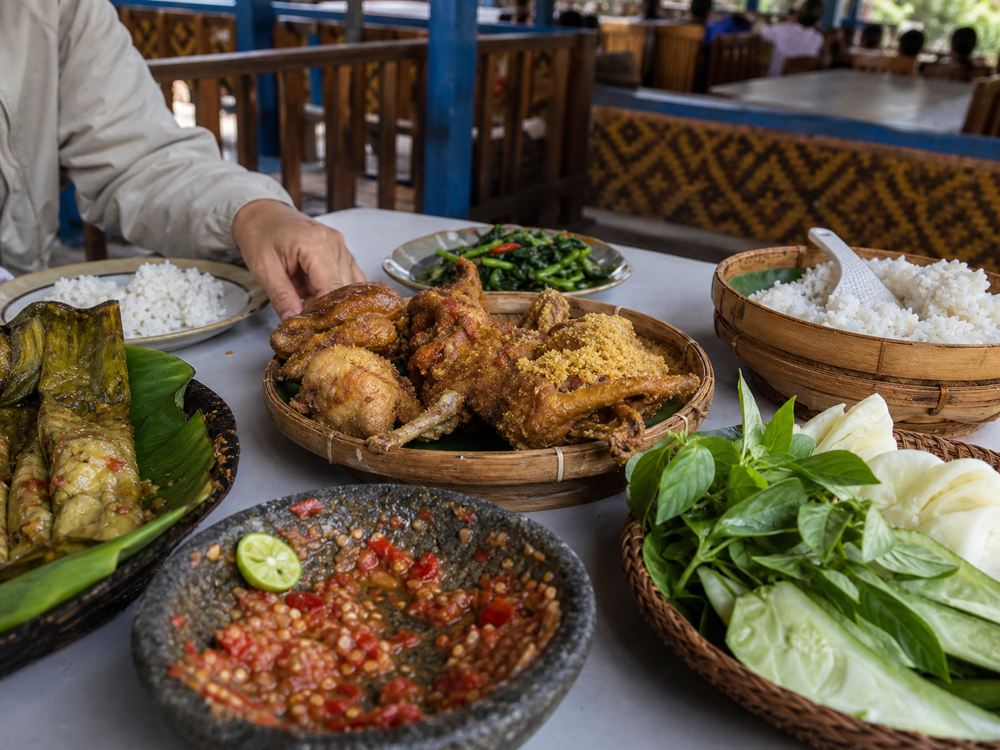

### Referensi Google Images

Query: `RM Mang Yeye Subang makanan foto`

[](https://www.pasundanekspres.co/2019/02/09/menikmati-akhir-pekan-di-rm-mang-yeye/)

Sumber: Pasundan Ekspres, liputan langsung RM Mang Yeye. Dipilih untuk mengikat konteks rumah makan ke lokasi nyata; rincian menu pada prompt mengikuti ayam goreng, sambal, pepes, nasi bakul, dan lalapan yang disebut dalam liputan. Hak publikasi foto perlu dikonfirmasi.

### Prompt image-gen

```text
Create a photorealistic 4:3 editorial photograph of a Sundanese meal at RM Mang Yeye in Subang.

Input images: Image 1 is the factual restaurant-food reference for dishes, serving vessels, portions, and table atmosphere. Image 2 is only the current card composition guide.

Show a casual shared spread with ayam goreng kampung, sambal dadak in a stone mortar, lalapan, pepes, rice, and one or two simple vegetable dishes. Use ordinary plates and baskets consistent with a popular local restaurant, natural midday light, a slightly busy table, irregular portions, real fried textures, and a hint of the open-air rural setting out of focus. 35mm lens, candid editorial style.

Avoid banquet abundance, luxury plating, duplicated dishes, impossible cutlery, perfectly arranged leaves, excessive gloss, fake rice-field compositing, people as main subjects, text, logos, or watermarks.
```

---

## 14. `public/images/subang/video-posters/ciater-tea-plantation.webp`

**Label/judul:** Kebun Teh Ciater  
**Dipakai pada:** poster scene, detail destinasi, fallback hero, backdrop explorer, dan itinerary satu hari  
**Ukuran saat ini:** 1280 × 720 px, 16:9

### Image saat ini

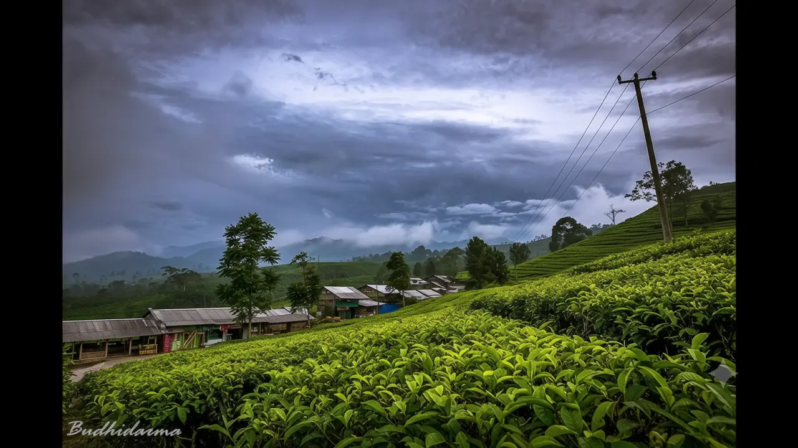

### Referensi Google Images

Query: `Kebun Teh Ciater Subang foto asli`

[](https://commons.wikimedia.org/wiki/File:Perkebunan_Teh.jpg)

Sumber: Wikimedia Commons, Ciater, Subang; CC BY-SA 4.0. Dipilih karena merupakan referensi lokasi yang kuat untuk bentuk kebun teh dan latar gunung.

### Prompt image-gen

```text
Generate a photorealistic 16:9 documentary video poster of Kebun Teh Ciater, Subang.

Input images: Image 1 is the factual location reference. Image 2 is the existing poster and only guides the wide framing and focal placement.

Show real working tea fields following uneven terrain, narrow dirt paths, mature shade trees, and a softly hazy volcanic ridge. Early morning after light rain, subdued cloud-filtered daylight, damp leaves without artificial sparkle, realistic distance falloff, 28mm lens at eye level, natural Indonesian color palette, mild camera grain. Compose a strong foreground-to-background path suitable for a video thumbnail.

Avoid perfect CGI tea rows, fantasy mountains, golden sunbeams, excessive mist, oversaturated green, staged fashion models, text, logos, or watermarks.
```

---

## 15. `public/images/subang/video-posters/curug-cileat-waterfall.webp`

**Label/judul:** Curug Cileat  
**Dipakai pada:** poster scene, detail destinasi, dan kartu destinasi  
**Ukuran saat ini:** 1280 × 720 px, 16:9

### Image saat ini

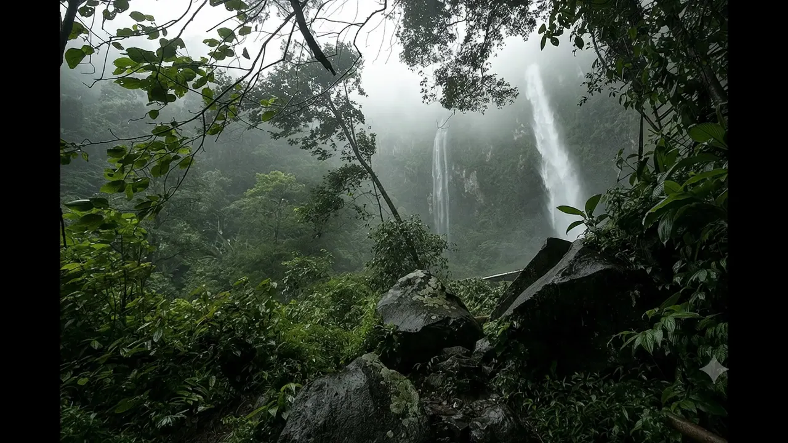

### Referensi Google Images

Query: `Curug Cileat Subang foto asli`

[](https://commons.wikimedia.org/wiki/File:Curug_Cileat.jpg)

Sumber: Wikimedia Commons, Curug Cileat; CC BY 4.0 pada halaman sumber. Dipilih karena menangkap tinggi air terjun, dinding lembah, vegetasi, dan skala lokasi nyata.

### Prompt image-gen

```text
Create a photorealistic 16:9 documentary video poster of Curug Cileat in Subang, West Java.

Input images: Image 1 is the factual reference for the very tall waterfall, cliff geometry, forest density, and scale. Image 2 is the current poster and only guides crop and visual emphasis.

Frame the tall narrow falls within a broad, humid forested valley. Keep volcanic rock irregular, vegetation dense but botanically plausible, water volume believable, and the plunge pool naturally dark. Include one or two tiny hikers far from camera only to communicate scale. Soft overcast daylight, 24mm lens, slight water motion blur, restrained greens, realistic haze and damp rock texture.

Avoid widening the waterfall, inventing extra cascades, turquoise water, tropical fantasy plants, dramatic god rays, oversized people, HDR halos, text, logos, or watermarks.
```

---

## 16. `public/images/subang/video-posters/sisingaan-performance.webp`

**Label/judul:** Atraksi Sisingaan  
**Dipakai pada:** poster scene dan detail budaya  
**Ukuran saat ini:** 1280 × 720 px, 16:9

### Image saat ini

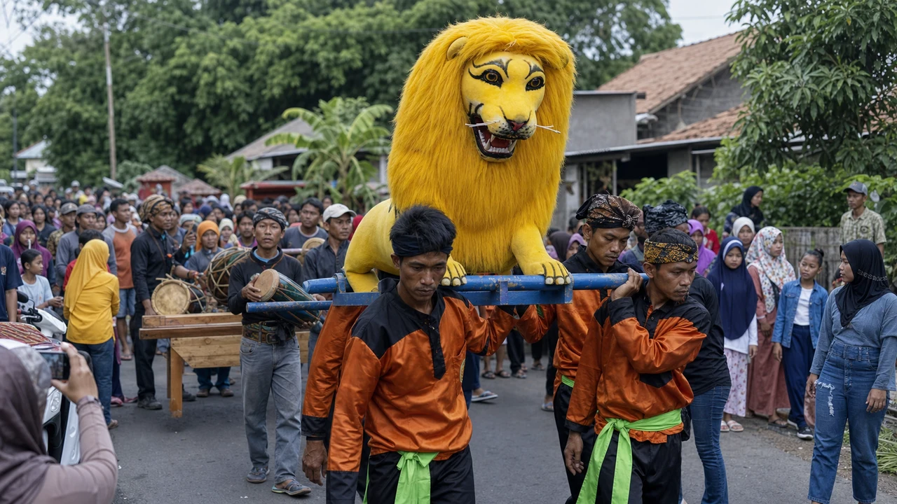

### Referensi Google Images

Query: `Sisingaan Subang pertunjukan foto asli`

[](https://commons.wikimedia.org/wiki/File:Atraksi_Kesenian_Sisingaan.jpg)

Sumber: Wikimedia Commons, atraksi Sisingaan di Subang; CC BY-SA 4.0. Referensi dipakai ulang untuk akurasi budaya, dengan framing horizontal khusus poster scene.

### Prompt image-gen

```text
Generate a photorealistic 16:9 photojournalistic video poster of a Sisingaan procession in Subang.

Input images: Image 1 is the factual cultural reference. Image 2 is the current scene poster and only guides the horizontal crop.

Show one authentic lion effigy carried on bamboo poles by exactly four performers, moving through a real neighborhood crowd with musicians visible in the midground. Capture energy through natural posture and slight fabric motion, while keeping faces, hands, pole connections, and weight distribution anatomically believable. Daytime available light, 28mm lens from crowd height, modest contrast, real street clutter, documentary color.

Do not create a living lion, extra bearers, duplicated faces, floating poles, fantasy costume, staged studio lighting, readable signs, text, logos, or watermarks.
```

---

## 17. `public/images/subang/video-posters/subang-hero-montage.webp`

**Label/judul:** Hero video perjalanan Subang  
**Dipakai pada:** poster video utama landing page  
**Ukuran saat ini:** 1280 × 720 px, 16:9

### Image saat ini

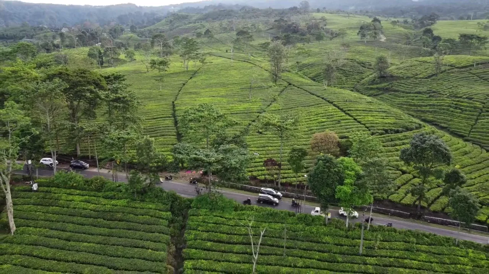

### Referensi Google Images

Query: `Kebun Teh Ciater Subang foto asli`

[](https://commons.wikimedia.org/wiki/File:Perkebunan_Teh.jpg)

Sumber: Wikimedia Commons, Ciater, Subang; CC BY-SA 4.0. Satu lokasi nyata dipilih sebagai establishing shot agar poster tidak terasa seperti montase AI yang menggabungkan banyak geografi.

### Prompt image-gen

```text
Create a photorealistic 16:9 establishing frame for a Subang tourism hero video, grounded in the real Ciater tea landscape.

Input images: Image 1 is the factual location reference. Image 2 is the current hero poster and only guides subject placement, contrast behind the headline, and wide crop.

Use one coherent real scene rather than a collage: a local visitor in practical casual clothing walking along an irregular path through Ciater tea fields, seen small and from behind. Rolling tea rows and mature trees lead toward a naturally hazy mountain ridge. Soft morning cloud light, 28mm lens, documentary travel-film still, subdued green tones, believable fabric and terrain, slight atmospheric grain. Keep the central headline area calm and readable.

No montage, no combined beach-waterfall-mountain geography, no heroic pose, no fantasy sunrise, no flawless fashion styling, no text rendered into the image, no logo, and no watermark.
```

---

## 18. `public/images/subang/video-posters/subang-north-coast.webp`

**Label/judul:** Pantai Tanjung Cirewang  
**Dipakai pada:** poster scene, detail destinasi, dan kartu destinasi Pantai Cirewang  
**Ukuran saat ini:** 1280 × 720 px, 16:9

### Image saat ini

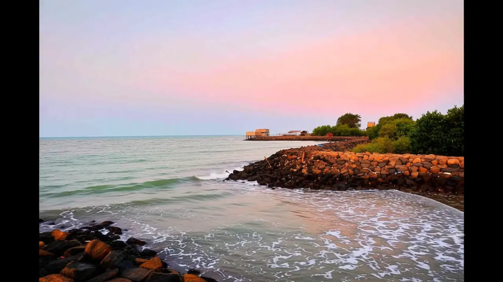

### Referensi Google Images

Query: `Pantai Cirewang Subang foto asli`

[](https://www.inilah.com/pantai-cirewang-subang)

Sumber: Inilah.com. Dipilih untuk warna air dan pasir, pohon pesisir, serta karakter Cirewang yang tidak menyerupai pantai resor. Hak publikasi perlu dikonfirmasi.

### Prompt image-gen

```text
Generate a photorealistic 16:9 documentary video poster of Pantai Tanjung Cirewang in Subang.

Input images: Image 1 is the factual reference for shoreline shape, brown sand, calm Java Sea, mangrove/coastal trees, and local atmosphere. Image 2 is the current poster and only guides its wide composition.

Show an honest north-coast landscape at low tide: muted blue-gray water, brown sandy shore, exposed natural textures, irregular coastal trees and mangrove vegetation, small local boats or distant visitors only if plausible. Late-afternoon daylight with coastal haze, 28mm lens, natural dynamic range, modest color, no staged subject. Keep the horizon level and the coast recognizable at thumbnail size.

Do not create white sand, crystal turquoise water, palms from a tropical resort, dramatic cliffs, perfect mirror reflections, purple fantasy sky, excessive driftwood, text, logos, or watermarks.
```

---

## 19. `public/images/subang/video-posters/subang-pineapple.webp`

**Label/judul:** Nanas Subang dan kebun petani  
**Dipakai pada:** poster scene, detail destinasi, dan kartu kuliner Nanas Subang  
**Ukuran saat ini:** 1280 × 720 px, 16:9

### Image saat ini

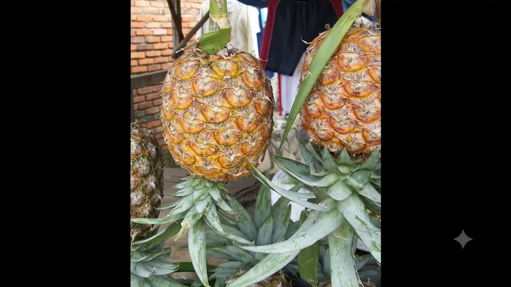

### Referensi Google Images

Query: `Nanas Subang kebun petani foto asli`

[](https://www.dompetdhuafa.org/gairah-kembali-pak-ade-petani-nanas-bangkit-lewat-ikon-dompet-dhuafa/)

Sumber: Dompet Dhuafa, dokumentasi program petani nanas Subang. Dipilih karena menunjukkan tanaman, buah, petani, tanah, dan kondisi kebun Subang secara nyata. Hak publikasi perlu dikonfirmasi.

### Prompt image-gen

```text
Create a photorealistic 16:9 editorial documentary photograph of a pineapple farmer in a real Subang field.

Input images: Image 1 is the factual reference for local field layout, plant scale, fruit appearance, soil, clothing, and working context. Image 2 is the current scene poster and only guides the wide composition.

Show an Indonesian farmer naturally inspecting or harvesting mature Subang pineapple among dense low rows. The fruit should have believable Smooth Cayenne-like proportions, irregular eyes, dust, minor blemishes, and varied ripeness. Use practical farm clothing, natural posture and hands, humid morning daylight, ordinary soil and weeds, 35mm environmental-portrait lens, restrained saturation, fine camera grain. Keep the person secondary to the agricultural setting.

Avoid giant perfect fruit, identical plants, spotless leaves, fashion styling, posed advertising smiles, golden fantasy light, impossible hand placement, text, logos, or watermarks.
```

---

## Checklist sebelum mengganti file

- Pastikan output mempertahankan rasio dan minimal resolusi file lama.
- Bandingkan output dengan foto referensi, bukan hanya dengan aset AI lama.
- Untuk manusia, periksa wajah, tangan, jari, kaki, arah pandang, dan interaksi dengan objek.
- Untuk lokasi, periksa warna air, jenis vegetasi, topografi, material bangunan, cuaca, dan skala.
- Untuk makanan, periksa tekstur, porsi, alat saji, bayangan kontak, uap, dan bentuk garnish.
- Untuk Sisingaan, pastikan satu tandu ditopang empat pengusung dan tidak berubah menjadi singa hidup/fantasi.
- Untuk `subang-360-preview.webp`, edit hanya area panorama; jangan regenerate seluruh UI.
- Hapus semua tulisan, logo, atau watermark yang mungkin terbentuk.
- Uji hasil final di landing page dan `/jelajahi` pada desktop serta mobile sebelum mengganti aset produksi.
