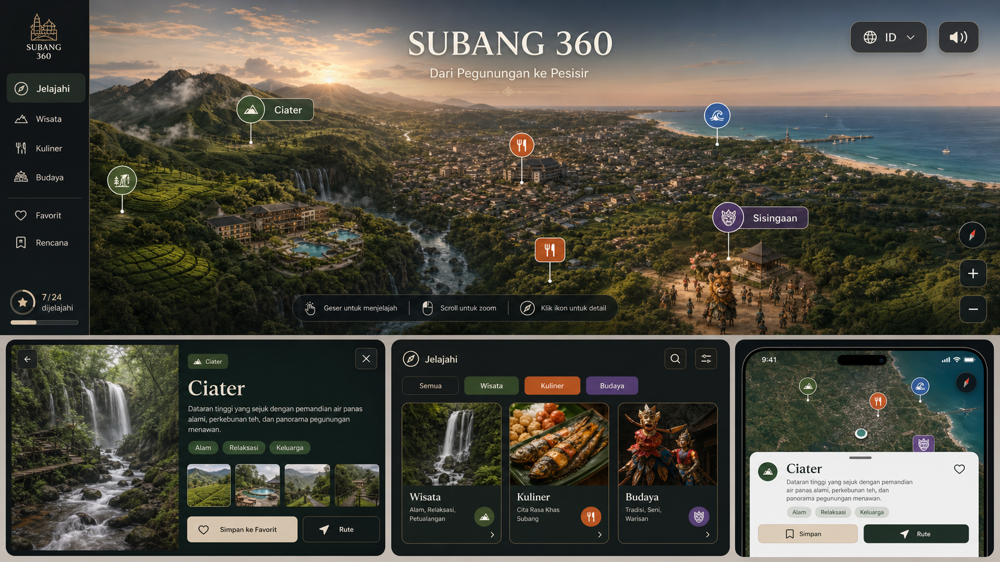

# PRD: Subang 360

## Visual Reference

Gambar ini adalah acuan arah visual dan interaksi, bukan representasi geografis atau budaya yang harus disalin secara literal. Implementasi harus memakai data lokasi yang benar dan dokumentasi Sisingaan yang autentik.

## Problem Statement

Wisatawan domestik belum memiliki pengalaman digital yang dapat memperlihatkan sisi premium Kabupaten Subang sekaligus menghubungkan wisata, kuliner, dan budaya dalam satu eksplorasi yang menarik. Starter saat ini masih berupa landing page Tarutung dengan scene 3D dekoratif, mini-map terpisah, dan konten pengantar teknis. Pengalaman tersebut belum memiliki identitas Subang, belum menjadikan eksplorasi sebagai fokus utama, dan belum memberikan hubungan langsung antara landmark, cerita, serta tindakan pengguna.

Proyek hanya memiliki waktu development satu hari. Karena itu, produk harus menjadi MVP yang fokus: satu pengalaman fullscreen bernama **Subang 360**, menggunakan fondasi Three.js, Leaflet, data fallback, dan API tempat yang sudah tersedia. Produk tidak boleh berkembang menjadi portal wisata dengan banyak halaman atau sistem perjalanan lengkap.

## Solution

Bangun **Subang 360** sebagai homepage sekaligus pengalaman utama. Pengunjung langsung melihat lanskap Subang yang dapat dieksplorasi, dengan 6-8 hotspot terkurasi dalam kategori Wisata, Kuliner, dan Budaya. Pengguna dapat memutar sudut pandang, memilih kategori, membuka panel detail, melihat progres landmark yang sudah dikunjungi, menyalakan audio ambience secara sukarela, dan membuka rute eksternal menuju lokasi.

Pada desktop, kontrol utama ditempatkan dalam sidebar ringkas dan panel detail. Pada mobile, scene tetap fullscreen sementara kontrol kategori dan detail tampil sebagai bottom sheet. Kesan premium dibangun melalui komposisi sinematik, tipografi yang tenang, fotografi berkualitas, gerak kamera yang halus, dan UI yang tidak padat.

MVP menggunakan terrain/scene 3D bergaya sinematik yang dapat diorbitkan. Istilah “360” pada fase ini berarti pengalaman pandangan yang dapat diputar mengelilingi scene, bukan video 360, photogrammetry, atau terrain GIS yang akurat.

## User Stories

1. As a wisatawan domestik, I want to immediately enter an immersive Subang experience, so that I can understand the destination without reading a conventional landing page.
2. As a first-time visitor, I want to see the name “Subang 360” and a concise value proposition, so that I know what experience I am opening.
3. As a visitor, I want to rotate the scene horizontally, so that I can explore Subang from different directions.
4. As a desktop visitor, I want to zoom the scene with a familiar interaction, so that I can inspect landmarks without learning a new control system.
5. As a mobile visitor, I want touch-friendly pan and zoom controls, so that the experience remains usable on my phone.
6. As a visitor, I want visible hotspot markers, so that I know which parts of the scene are interactive.
7. As a visitor, I want hotspot labels to remain readable over the terrain, so that I can identify destinations before selecting them.
8. As a visitor, I want to filter hotspots by Wisata, Kuliner, or Budaya, so that I can focus on my interests.
9. As a visitor, I want a “Semua” filter, so that I can restore the complete exploration view.
10. As a visitor, I want each category to have a consistent color and icon, so that I can distinguish hotspot types quickly.
11. As a visitor, I want to open a destination detail panel by selecting a hotspot, so that I can learn about the place without leaving the explorer.
12. As a visitor, I want each detail panel to show a title, image, short story, tags, and practical location action, so that the information is useful but concise.
13. As a visitor, I want to close the detail panel and return to the same scene position, so that my exploration is not reset.
14. As a visitor, I want the selected hotspot to be visually highlighted, so that I understand which destination is currently open.
15. As a visitor, I want a direct “Rute” action, so that I can continue to an external maps application.
16. As a visitor, I want visited hotspots to be recorded locally, so that I can see my exploration progress.
17. As a returning visitor on the same device, I want my visited progress to persist, so that I do not lose my previous exploration.
18. As a visitor, I want to see progress such as “3/8 dijelajahi”, so that the experience encourages me to discover more destinations.
19. As a visitor, I want audio ambience to be disabled initially, so that the website never plays unexpected sound.
20. As a visitor, I want one clear audio toggle, so that I can enable or mute the atmosphere at any time.
21. As a visitor, I want the scene animation to pause when the browser tab is inactive, so that the website does not waste device resources.
22. As a visitor with reduced-motion preferences, I want a calmer experience, so that motion does not prevent me from using the website.
23. As a keyboard user, I want category controls, audio controls, hotspots, and the detail panel to be reachable and understandable, so that the core experience is not mouse-only.
24. As a mobile visitor, I want controls and details in a bottom sheet, so that they do not cover the entire scene.
25. As a desktop visitor, I want a compact sidebar, so that the scene remains the dominant visual element.
26. As a visitor on a slow connection, I want a meaningful loading state and optimized images, so that I understand the experience is preparing.
27. As a visitor on a device without working WebGL, I want a static visual fallback with accessible hotspot navigation, so that the core content remains available.
28. As a visitor, I want authentic Subang photography and culturally correct Sisingaan material, so that the experience is trustworthy.
29. As a content maintainer, I want hotspot content to come from one normalized place model, so that scene markers and detail panels do not diverge.
30. As a content maintainer, I want local fallback content to remain available when Notion is not configured or fails, so that the homepage never becomes empty.
31. As a developer, I want the MVP limited to 6-8 curated hotspots, so that it can be completed within one development day.
32. As a developer, I want browser-only scene logic isolated from server-side content loading, so that Next.js rendering remains stable.

## Implementation Decisions

- Replace the conventional multi-section landing page with one fullscreen Subang 360 experience. Supporting content appears inside the explorer rather than as long page sections.
- Reuse the existing Next.js App Router, TypeScript, Tailwind, Three.js, Leaflet, Notion adapter, and JSON place endpoint. Do not introduce another frontend framework or 3D engine.
- Rebrand the existing Tarutung domain model and visible content to Subang. Remove Tarutung-specific fallback records, labels, coordinates, and editorial copy from the user-facing experience.
- Limit the MVP to 6-8 curated hotspots. The initial set must cover all three categories and should prioritize recognizable, visually strong, and verifiable Subang experiences.
- Use four filter states: Semua, Wisata, Kuliner, and Budaya. Filtering changes marker visibility without rebuilding or resetting the scene.
- Treat the experience as four explicit UI states: loading/fallback, default exploration, filtered exploration, and destination detail open.
- Use Three.js for the orbitable cinematic terrain and camera movement. Use DOM-based overlays for navigation, filters, labels, progress, audio controls, and detail panels so the interface remains readable and accessible.
- “Subang 360” in this MVP is a stylized orbitable terrain experience. It is not a geographically exact 3D map, Street View replacement, video 360 tour, or photogrammetry product.
- Keep the existing map integration only where it provides practical location context or an external route action. Do not render a second competing full map on the homepage.
- Extend the normalized place contract to support the explorer: category, summary, coordinates, hero image, optional gallery, tags, location label, maps URL, display order, and featured state.
- Keep Notion optional. When configuration is missing, invalid, empty, or unavailable, serve complete Subang fallback data without displaying an error to visitors.
- Store visited hotspot IDs in local storage. Progress is device-local and does not require an account.
- Do not implement favorites or itinerary planning in this MVP. The visual reference includes these concepts, but they exceed the one-day scope.
- Audio uses one lightweight looping ambience asset, is off by default, and starts only after an explicit user gesture. If the production audio asset is unavailable, hide the control instead of presenting a non-functional button.
- Desktop uses a compact left sidebar and a detail panel that does not obscure the selected marker. Mobile uses icon controls and a bottom sheet with a clear close or swipe-down affordance.
- Cap renderer pixel density, dispose of Three.js resources on unmount, pause rendering when the document is hidden, and lazy-load non-critical images.
- Respect `prefers-reduced-motion` by reducing automatic camera motion and non-essential transitions.
- Provide a static poster and accessible list fallback when WebGL initialization fails.
- Use the supplied concept image only as art direction. Do not reproduce fictional geography, combine unrelated locations as factual scenery, or use the generated Sisingaan depiction as a cultural source of truth.
- Use real, licensed, and verified Subang media for production. Sisingaan imagery must accurately show the local performance tradition.
- Keep Bahasa Indonesia as the only interface language for this one-day MVP. The language selector shown in the concept is out of scope.
- The external route action opens a configured maps URL in a new context and does not implement internal turn-by-turn navigation.
- Do not add authentication, database persistence for user state, payments, reservations, or third-party booking integrations.
- The deliverable is responsive at desktop and common mobile widths. Tablet uses the mobile interaction model when horizontal space is insufficient for the sidebar.

## Testing Decisions

- No unit tests, integration tests, or automated end-to-end tests will be created. This is an explicit delivery decision because implementation time is limited to one day.
- Quality verification is limited to the existing project gates: lint, TypeScript checking, and production build.
- Perform one manual smoke check at a desktop viewport and one at a mobile viewport.
- The smoke check verifies only external behavior: initial load, 3D or static fallback visibility, category filtering, hotspot selection, detail close behavior, external route link, visited progress persistence, audio opt-in, and reduced-motion behavior.
- Confirm that the page remains usable with Notion configuration absent by exercising the fallback data path.
- Confirm that no Tarutung copy or location data remains visible in the final Subang experience.
- Visual verification must confirm that labels and controls do not overlap, the scene is not blank, mobile text fits, and the detail panel does not prevent returning to exploration.

## Out of Scope

- Automated test suites or testing infrastructure.
- More than 8 launch hotspots.
- Real GIS terrain, photogrammetry, Street View, or panoramic video production.
- A conventional marketing landing page or long editorial homepage.
- User accounts, authentication, cloud-synced progress, and cross-device state.
- Favorites, itinerary builder, route optimization, or saved travel plans.
- Booking, payment, ticketing, reservations, and commerce integrations.
- Multilingual interface or translation workflow.
- Full Notion schema migration or a custom CMS admin interface.
- Live weather, traffic, opening-hours feeds, events, or dynamic pricing.
- User reviews, ratings, comments, and user-generated content.
- Advanced analytics, personalization, recommendations, or AI assistant features.
- Production photography, drone filming, audio recording, and cultural documentation work.
- Claiming that the generated concept image is a literal map or documentary representation of Subang.

## Further Notes

- Primary audience: Indonesian domestic travelers seeking a short, high-quality weekend experience, especially visitors from Jabodetabek, Bandung, and surrounding West Java.
- Product positioning: **Subang sebagai destinasi premium terdekat untuk menikmati alam, rasa, dan budaya dalam satu pengalaman interaktif.**
- The definition of “luxury” is visual quality, curation, hospitality, calm motion, and credible storytelling. Avoid gold-heavy decoration or generic luxury clichés.
- The strongest success signal for the MVP is that a first-time visitor can identify Subang’s three experience categories, open at least one hotspot, and understand how to visit it without leaving the main explorer until they choose the external route action.
- The supplied concept image and the PRD image asset must remain together so the relative Markdown link renders correctly.
